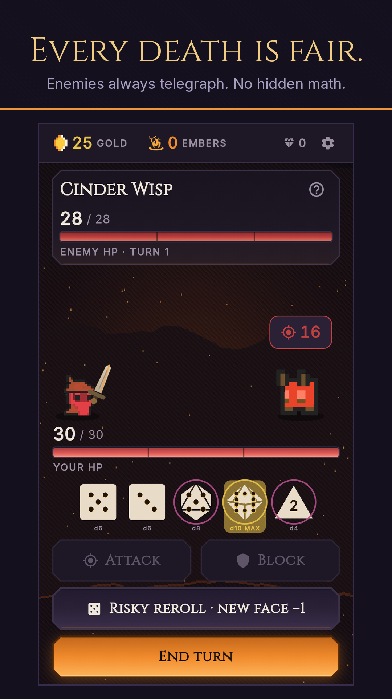
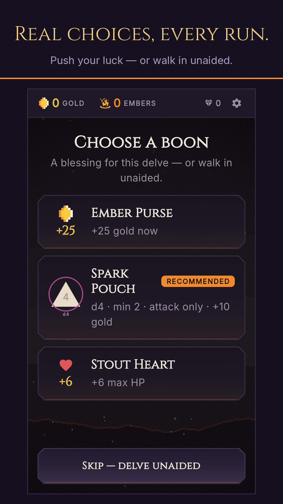
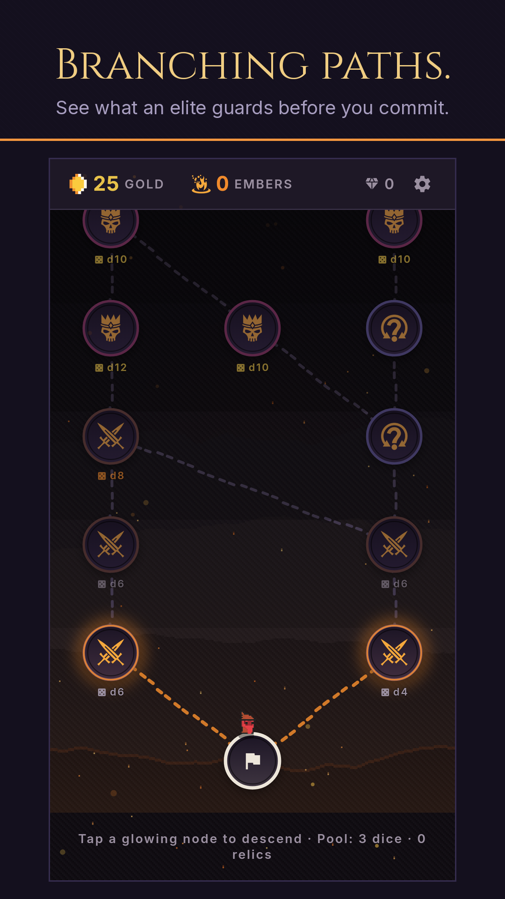
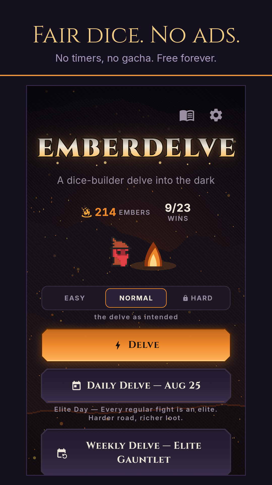
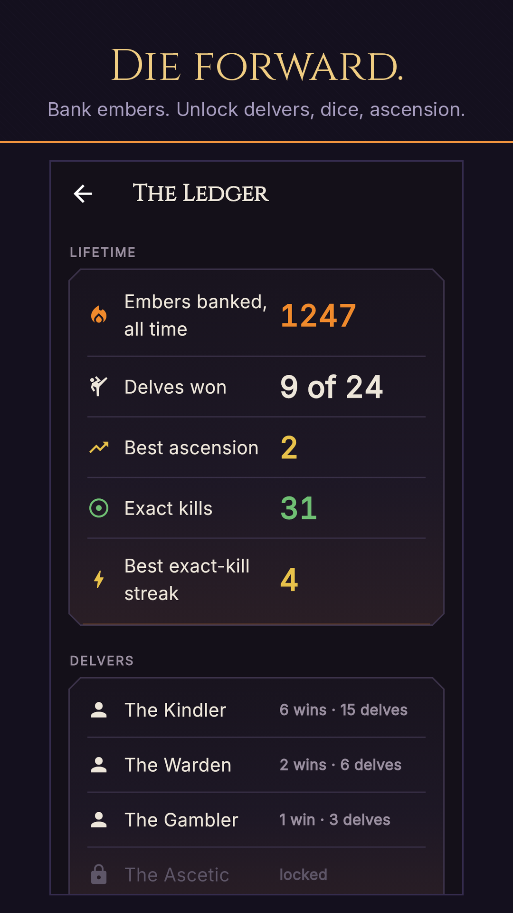

# Emberdelve

A dark, turn-based **dice-builder roguelite** for Android. Roll, assign,
and forge dice as you delve toward the ember at the bottom of the world.

**No ads. No energy timers. No tracking unless you opt in.** Runs are
seeded and fully deterministic — share a seed, share the exact delve.

  
  
  
  
  

## Download

**[⬇ Latest release](https://github.com/tapiwamakandigona/emberdelve/releases/latest)** —
grab `emberdelve-vX.Y.Z-arm64-v8a.apk` (most phones since ~2016).
Every release ships SHA-256 checksums and is signed in CI with the
permanent Tsoro Studios key; notes explain exactly what changed and why.

| Your device | File |
| --- | --- |
| Most Android phones | `...-arm64-v8a.apk` |
| Older 32-bit phones | `...-armeabi-v7a.apk` |
| Emulators / Chromebooks | `...-x86_64.apk` |
| Not sure | `...-universal.apk` (bigger, works everywhere) |

Also on [Google Play (public early access)](https://play.google.com/store/apps/details?id=com.tsorostudios.emberdelve) ·
[download page](https://tapiwa.me/emberdelve/)

## The game

- **Roll → assign → forge.** Every turn you roll your pool and split it
  between attack and block. Between fights you forge dice into stronger,
  stranger shapes and temper runes onto faces.
- **Fair by construction.** The enemy's intent is always visible; the sim
  is a sealed, deterministic core with no hidden modifiers. When you die,
  it was the build — and the seed lets you prove it.
- **Four characters** (Kindler, Warden, Gambler, Ascetic), 35 enemies,
  6 bosses, 31 events, 26 relics, daily trials, ascension ladders.
- **Respects you**: play offline, no account, TalkBack-friendly
  (v0.19.0), reduce-motion mode, colorblind-safe UI, saves stay on your
  device. The one paid unlock (Hard + Ascension) is a single purchase —
  never consumables, never a second currency.

## For developers (human or AI)

1. `PROJECT.md` — goal, standing decisions, session-start ritual
2. `features.json` — machine-readable definition of done
3. `progress.md` — history; `checkpoints/` — phase gates
4. `flutter pub get && flutter test` — environment up + test suite

### Layout
- `lib/sim/` — sealed pure-Dart simulation core (commands in, events out; deterministic, seeded; no Flutter/dart:io imports)
- `lib/ui/` — Flutter presentation layer (custom-painted, no stock Material look)
- `lib/data/` — content as data modules (dice, foes, relics, boons, events)
- `lib/game/` — controller gluing sim to UI (autosave, choreography)
- `bin/autoplay.dart` — headless balance harness (`dart run bin/autoplay.dart 200`)
- `test/` — sim + widget suite, incl. overflow, semantics, and balance gates
- `docs/` — spec + architecture + sim contract (`docs/spec.md` §Ethics is binding)
- `.github/workflows/ci.yml` — analyze/test gate → signed Android APK+AAB

### Release signing
Release builds are signed in CI from repository secrets (see `docs/release.md`).
Without a local `android/key.properties` the build falls back to debug signing,
so contributors can build and run without any secrets.
