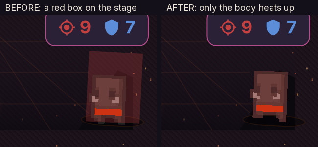
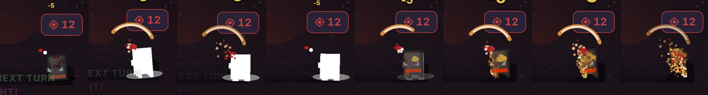

# Living Foes — evidence (2026-09-24)

Presentation-only enemy animation pass on `legacy/dice-builder`, stacked in
PR #108 after the exact-kill Clean Cut. Scope and decisions: `PROJECT.md`.
Definition of done: `features.json`.

## What changed

| Feature | Before | After |
|---|---|---|
| **Ashfall** (`5c4a2d4`) | Dead foe faded out and sank. | Heat sweeps in from the side the blow came from; every art pixel flares ember → gold → white-hot, tears loose, tumbles away from the delver and cools to ash. Same 700 ms beat. |
| **Charging foes** (`ad51b5e`) | Idle pose slid across the stage. | The authored run row plays at 14 fps for the lunge (31/42 sheets have one; others keep idle). |
| **Living idles** (`508960b`) | One shared 2px bob. | Wisps/moths/shades **hover** off their shadow, brutes/golems/bosses/elites **heave**, crawlers **scuttle**. |
| **Wind-up heat fix** (`ed0f710`) | Translucent red box over the stage on every enemy wind-up. | Only the body's own pixels warm up. |





## How it works

- `lib/ui/ashfall.dart` — `AshfallModel` is pure and deterministic: whole at
  t=0, every pixel loose by 0.58, gone by 0.98 of the death beat.
  `SpriteAshfall` draws the idle frame's art pixels with two `drawRawAtlas`
  passes (body: modulate toward ash; heat: dstIn glow silhouette), reusing
  typed buffers (no per-frame allocation) and stopping when done.
- `SpriteSheetDef.pixelScale` reads sprite_meta `scale`; `cachedSheet()` is
  a warm-cache accessor that never starts a load.
- `SpriteView.fps` (row frame-rate override) and `SpriteView.idle`
  (`IdleStyle`, default `breathe` = the original bob, pixel-identical).
- `combat_pose.dart` — `IdleStyle`, `enemyIdleFor()` (whole `_` words),
  pure periodic `idleLife()`.
- Stage: the wind-up heat is `SpriteView.dye = ColorFilter.mode(0x55C24040 ×
  heat, srcATop)` driven by a `TweenAnimationBuilder` over
  `EnemyStrikePlan.windupMs` — the sprite paint tints only drawn pixels.

## Verification (all VERIFIED 2026-09-24, Flutter 3.44.9 / Dart 3.12.2)

| Gate | Result |
|---|---|
| `flutter analyze` | No issues found |
| `flutter test` | **1553/1553** (1526 inherited + 3 Clean Cut + 24 living foes) |
| `python3 tool/art/build_delvers.py --check` | pass |
| `python3 tool/sfx_headroom.py` | Every reachable cascade clears the ceiling |
| Protected paths vs `741b439` (`lib/sim`, pubspec, `android`, workflows, `assets`) | no diff |

New tests: `test/ashfall_test.dart` (11), `test/charging_foes_test.dart` (1),
`test/living_idles_test.dart` (11), `test/windup_heat_test.dart` (1). Each was
mutation-checked (feature wiring or gate removed → red); the wind-up pixel
test was red on the old code (empty-zone redness rise 41) before the fix.

## Reproduce the captures

```bash
flutter test tool/living_foes_frames_test.dart   # frames -> build/living_foes_frames/<foe>/
FOES=cinder_wisp,kiln_golem flutter test tool/living_foes_frames_test.dart
```

The harness drives the real `GameRoot`/`CombatScreen` (shipped fonts and
sprites, hit-tested production controls, 360×640 logical at 2×). It swaps the
foe's sprite id as a fixture only. 40 ms steps are simulated time, **not**
device frame timing.

## Open, by design

- Owner aesthetic approval (test APK) and physical-device FPS/touch.
- The enemy *art itself* is still the 16×16 / 32×36 upscaled sheets; a real
  enemy model redesign (the critique's "small enemy set") needs owner art
  direction first.

## Observation (not changed)

The local release build warns that `integration_test` and `jni` request
Android NDK 28.2.13676358 while `android/app/build.gradle.kts` pins
27.0.12077973. It is a warning today (build succeeds); worth a deliberate
bump before it becomes a hard failure.
