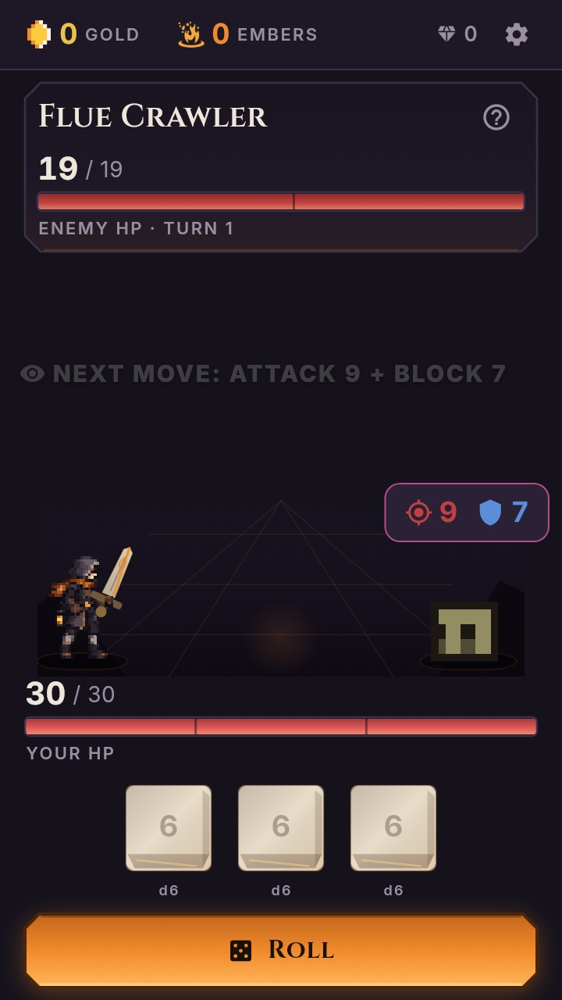
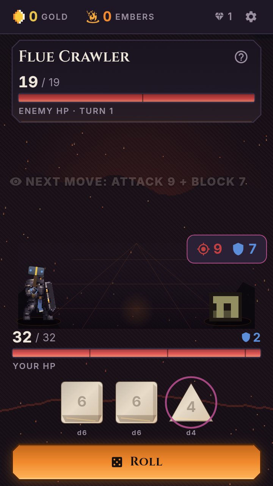
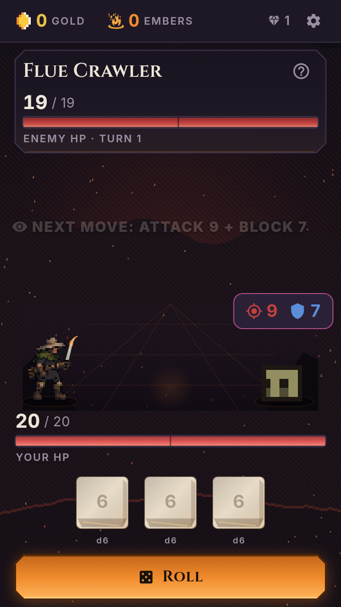

# September 19 release verification

**VERIFIED source/runtime/artifact checks:** unchanged Flutter3.44.9 analyzer,
1,526 tests, deterministic art reproduction and reachable SFX checks passed.
The unchanged whole-roster renderer passed72/72 after one adequately timed
retry. `local-roster-render-timeout.txt` preserves the first timeout.

`render-review.json` records66 phone combinations,12,540 observations,
132 independently checked outgoing-contact sequences and the protected-file
integrity check. `capture-inventory.json` hashes all4,608 generated PNGs.
The full raw captures are not committed; three current natural encounter-entry
captures are included here. Their hashes match the inventory.

These are actual GameRoot captures at2× PNG resolution, before combat fixture
mutation; not mockups or device screenshots. The full low/high combat sweep
uses explicitly controlled HP, roll and incoming-attack values (see unchanged
`tool/roster_review_test.dart` and `docs/roster-sep18/README.md`).

**Not verified:** direct aesthetic inspection or owner aesthetic sign-off,
physical-phone touch/FPS, complete naturally earned UI playthrough, and real
Play purchase/restore. No subjective “best visuals” claim follows from these
mechanical checks. Original open root acceptance criteria stay open.
