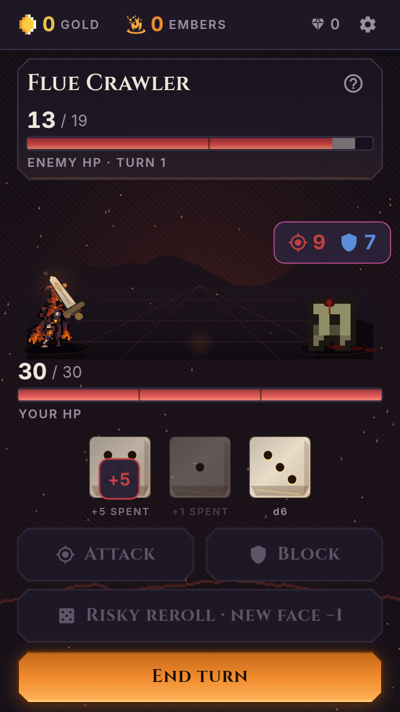
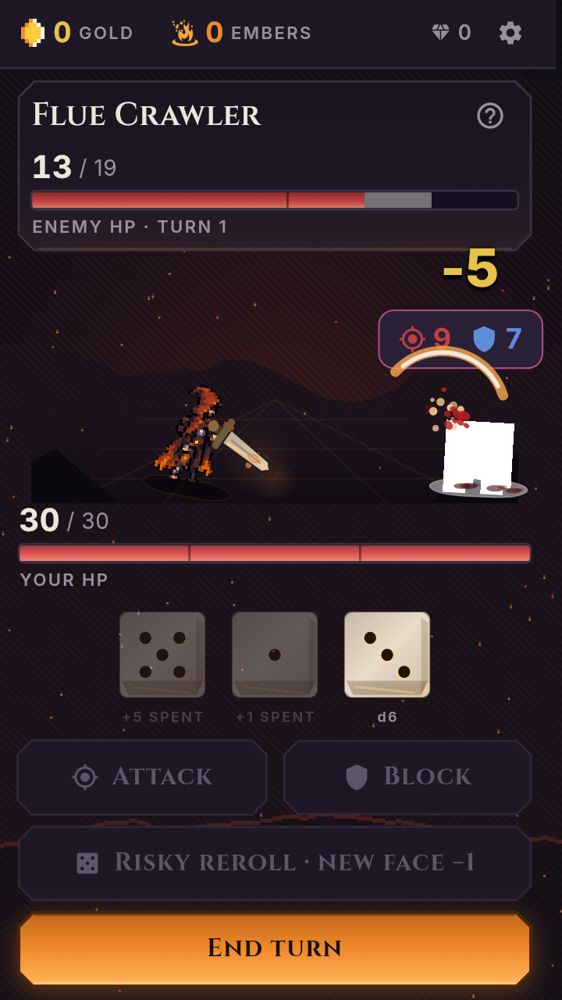
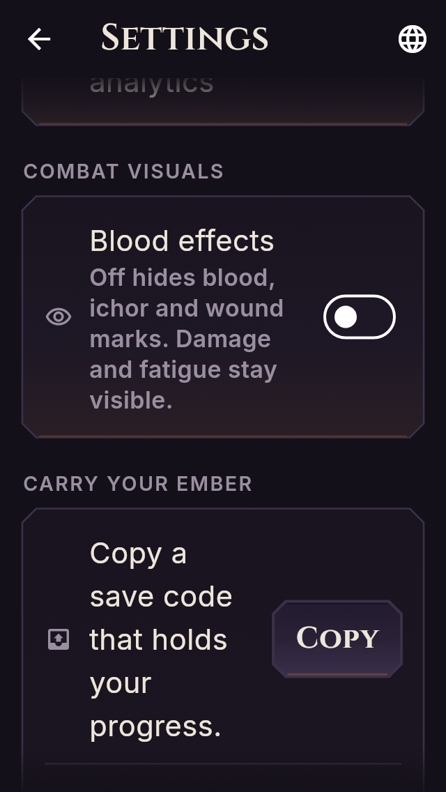

# Review evidence — 13 September 2026

Companion to [the critique and ratings](../combat-art-depth-critique-2026-09-13.md)
and [verification record](../blood-toggle-verification-2026-09-13.md).
All imagery below is actual shipped-source Flutter rendering; no generated
art or interpolated movement has been substituted.

## Current combat, normal starting health

| Delver | Signature weapon | Clip | Runtime observations |
|---|---|---|---|
| Kindler | Ember Brand | [7s video](kindler-current.mp4) | [JSON](kindler-observations.json) |
| Warden | Ward Maul | [7s video](warden-current.mp4) | [JSON](warden-observations.json) |
| Gambler | Lucky Fang | [7s video](gambler-current.mp4) | [JSON](gambler-observations.json) |
| Runesmith | Rune Chisel | [7s video](runesmith-current.mp4) | [JSON](runesmith-observations.json) |

Seed 1, easy, starting boon declined, first node 2 (Flue Crawler).
UI is 360 × 640 logical pixels; output 720 × 1280, 175 frames at 25 fps.
Motion setting `off` means **reduced motion off**, not animations disabled.
No audio is supplied. Sampling 25 frames per simulated second does not
measure device FPS, responsiveness or wall-clock performance.

Timeline shared by each clip:

| Clip time | Action |
|---|---|
| 0.00–0.40s | Idle |
| 0.40–0.80s | Select face 1 |
| 0.80–2.00s | Low-die attack |
| 2.00–2.40s | Select face 5 |
| 2.40–3.60s | High-die attack |
| 3.60–4.20s | Spend third die on block |
| 4.20–7.00s | Enemy turn |

The observations' `clip_ms` is an encoded clip timestamp. Each frame was
pumped 40 ms before capture. Weapon lists may contain incoming/outgoing
widgets during a hit-flash `AnimatedSwitcher`; that is recorded, not
silently reduced to an assumed single widget.

### Pre-contact condition issue

Kindler high strike, exact captured frames:

| 2.44s: windup, HP/wound already changed | 2.84s: after contact |
|---|---|
|  |  |

Frame 60 already reports HP 13 and wound count 1 with `weapon_phases:
["raise"]`, up from no wounds and HP 18 immediately before the attack.
See critique A3; fixing it is a next-agent task, not implemented here.

## Blood preference — actual font/layout plates

Settings at **320 × 568 logical pixels / 1.3× text scale**.
The whole new panel is framed after scrolling; surrounding page content
continues above/below the viewport.

| Locale | Blood on | Blood off | Geometry |
|---|---|---|---|
| English | [PNG](settings-en-on.png) | [PNG](settings-en-off.png) | [JSON](settings-en-geometry.json) |
| French | [PNG](settings-fr-on.png) | [PNG](settings-fr-off.png) | [JSON](settings-fr-geometry.json) |
| Spanish | [PNG](settings-es-on.png) | [PNG](settings-es-off.png) | [JSON](settings-es-geometry.json) |
| Portuguese (Brazil) | [PNG](settings-pt-on.png) | [PNG](settings-pt-off.png) | [JSON](settings-pt-geometry.json) |



The existing Portuguese app-bar title can ellipsise at this narrow width
and large scale. The new control's full label/helper fit; screenshots and
geometry verify the helper inside the panel inside the viewport.

## Injury comparisons and roster

These are **deliberately forced 20% HP fixtures**, not run-earned damage.
Both images retain the same injured condition; “off” is blood-off, **not**
a healthy character. On/off is captured without advancing simulated time.
Floor-stain removal is included, so the images are not a wound-only diff.

| Character | Blood on | Blood off |
|---|---|---|
| Kindler | [PNG](kindler-wounded-blood-on.png) | [PNG](kindler-wounded-blood-off.png) |
| Warden | [PNG](warden-wounded-blood-on.png) | [PNG](warden-wounded-blood-off.png) |
| Gambler | [PNG](gambler-wounded-blood-on.png) | [PNG](gambler-wounded-blood-off.png) |
| Runesmith | [PNG](runesmith-wounded-blood-on.png) | [PNG](runesmith-wounded-blood-off.png) |

[Full 22-delver static roster plate](roster.png).
It uses the game's renderer at 72 logical-pixel sprite height; it is a
technical comparison plate, not a new in-game roster screen.

The separate [unchanged-base wounded clip](baseline-wounded-combat.mp4)
uses the **existing** `tool/combat_bodies_frames_test.dart`: Kindler,
Warden, Gambler, Runesmith in that order, 2.8s each, 11.2s total.
Hero HP is deliberately 30%, foe HP 50%. The final two frames of each
segment follow an **uncaptured 3-second settle**; this discontinuity is
not real-time motion. [Baseline timeline](baseline-timeline.json).

## Depth sample

[Full report and per-seed state/event hashes](depth-report.json).
Existing greedy bot, 4 characters × 3 difficulties × seeds 1–50;
boons, keystones and tempers enabled, ascension 0, no mutators,
4,000-command safety cap. No invalid or nonterminal runs.
Medians use the average of the middle two values for even-sized samples.
This is diagnostic bot evidence, not player analytics or a rebalance mandate.

## Reproduce

Use the CI-pinned **Flutter 3.44.9 / Dart 3.12.2**.
Set `FLUTTER_ROOT` to the installed Flutter SDK for the Material Icons font.

```sh
flutter pub get
flutter test tool/art_depth_review_test.dart --reporter expanded
dart run tool/depth_review_probe.dart
python3 tool/package_art_depth_review.py
```

The packager requires ffmpeg and only encodes exact captured frames.
Raw PNG sequences remain in the ignored build output; a small selected
set plus clips, observations and plates are retained here. To reproduce
the earlier baseline separately, check out `b8b24a7` in another worktree:

```sh
BODIES_CHARS=kindler,warden,gambler,runesmith \
  flutter test tool/combat_bodies_frames_test.dart --reporter expanded
```

[Sanitised command output](verification.txt) includes successful gates,
negative controls and the two existing supplemental check failures.
[SHA-256 manifest](SHA256SUMS) covers the evidence files (excluding itself).
