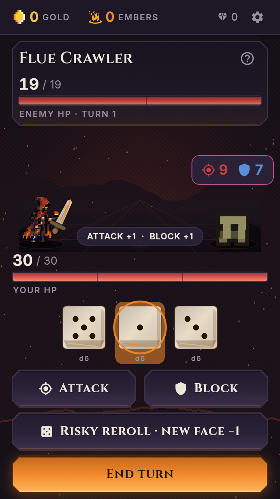
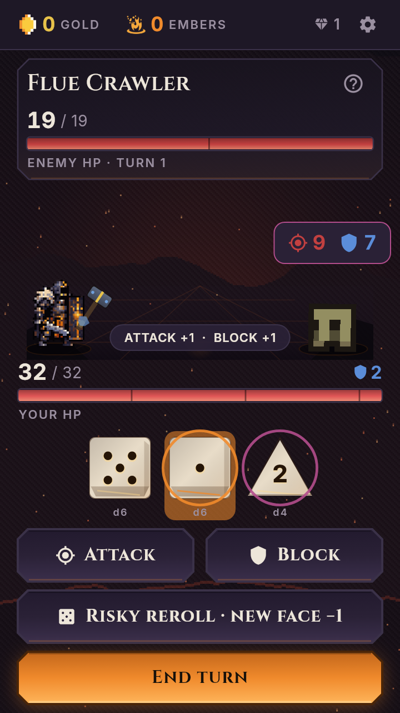
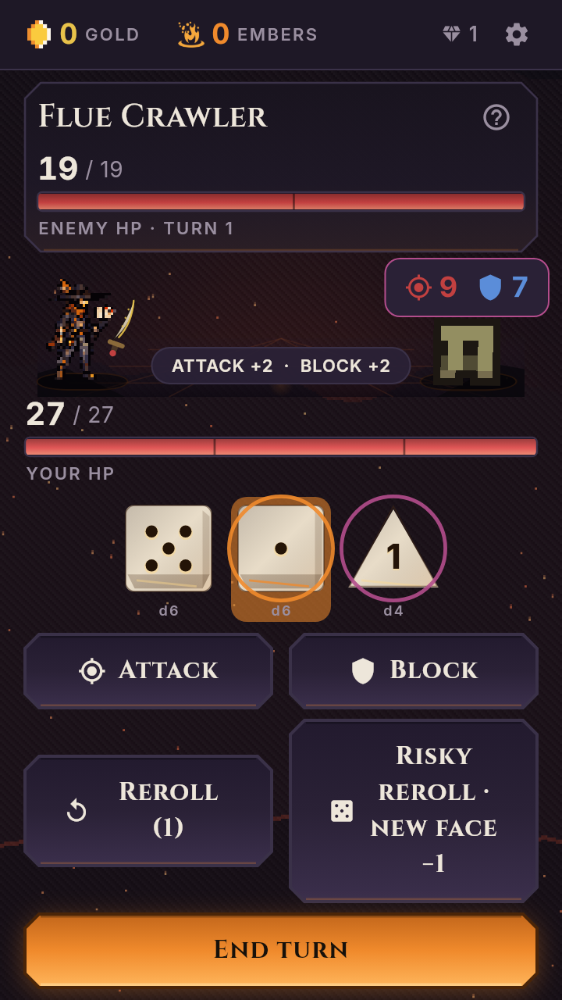
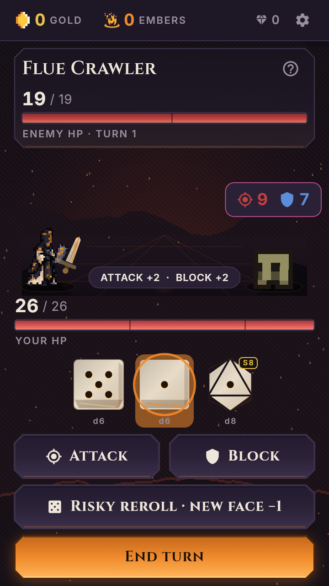

# Combat visual critique: the delver, weapon and die should feel like one action

## Verdict

**ASSUMED — design judgment:** the game has a richer ruleset than its combat
presentation communicates. A new delver currently changes the costume,
weapon silhouette and build, but not the body's way of attacking. The result
reads more like a character token sliding toward a target than a character
wielding a weapon. More glow, more roster entries or another menu feature
will not solve that.

The complaint is **not** that there are literally no animations or no response
to die values. Both exist. The missing layer is convincing attachment,
weapon-specific body mechanics and legible low/medium/high attack expression.
This PR records that critique and its acceptance plan; it does not fix it.

## What was actually opened and exercised

**VERIFIED:** I opened the official download page and itch page. Neither
offers a browser-playable build; itch lists the older `0.179.0` download.
I installed the unchanged, hash-pinned `0.182.0` x86_64 release APK on a
disposable Android emulator. Two capture-tool errors stopped at the optional
analytics prompt, before combat. Neither error was a game crash.

**VERIFIED substitute, explicitly not an Android playthrough:** the final
evidence exercises the real Flutter `GameRoot`/`CombatScreen` with the released
fonts, sprites and weapon painters, through hit-tested Roll, die, Attack and
End turn controls. Deterministic setup starts seed `1`, skips the boon and
enters node `2`, Flue Crawler. Tutorial flags are fixture setup only.
No damage, rolls, game source or animation timings are forced or changed.

Source `45fce851797ac81ea4767469ef838a45c257a88c` has byte-identical `lib`,
`assets`, `test`, `pubspec.yaml` and lockfile trees to the `0.182.0` release
source `8a9def489a748a65d343a5998ed1375d3ceb86ca`.
The weapon, sprite renderer, stage and attack-controller files also match
`v0.181.0`; the character sheets do not. Thus this is not a claim to have
inspected the owner's installed version or the older roster's exact visuals.

### Captured evidence

- **[22.4-second combat recording](combat-visual-2026-09-10/combat-four-delvers.mp4)**:
  actual rendered frames, four consecutive clips, **not native screen video**.
  Each clip is `5.6s`: Kindler `0–5.6`, Warden `5.6–11.2`, Gambler `11.2–16.8`,
  Runesmith `16.8–22.4`.
- Within each clip: select face `1`, Attack at approximately `0.8s`; select
  face `5`, Attack at `2.6s`; End turn at `4.0s`.
- Render surface: `360×640` logical / `720×1280` output; `25fps` simulated-time
  sampling, normal motion enabled. This is **not measured game FPS**.
- [Runtime observations](combat-visual-2026-09-10/observations.json),
  [verification manifest](combat-visual-2026-09-10/verification.json),
  and reproducible [capture harness](../../tool/combat_review_frames_test.dart).

| Actual case | Rolled values | Low/high face spent | Enemy HP progression |
|---|---|---|---|
| Kindler | 5, 1, 3 | 1 then 5 | 19 → 18 → 13 |
| Warden | 5, 1, 2 | 1 then 5 | 19 → 18 → 13 |
| Gambler | 5, 1, 1 | 1 then 5 | 19 → 17 → 12 |
| Runesmith | 5, 1, 1 | 1 then 5 | 19 → 17 → 12 |

**VERIFIED:** the paired low rolls in the latter cases resolve differently.
Do not equate the printed natural face with final damage when combos or
modifiers apply. An animation system must preserve that distinction.

## 1. The weapon is positioned beside the character, not authored with the hand

**VERIFIED source:** every character uses the same attachment:
`bottom = spriteHeight × 0.02`, horizontal offset `spriteHeight × 0.30`.
The weapon's own grip is `width × 0.5, height × 0.66`.
There are no per-character/per-pose hand sockets in this path.
The sprite's idle bob happens inside its separate painter, while the weapon
has its own sway clock. A shared outer lunge does not make those two internal
motions a coherent grip.

Source anchors:
[shared placement](https://github.com/tapiwamakandigona/emberdelve/blob/45fce851797ac81ea4767469ef838a45c257a88c/lib/ui/screens/combat/stage.dart#L388-L428),
[weapon grip](https://github.com/tapiwamakandigona/emberdelve/blob/45fce851797ac81ea4767469ef838a45c257a88c/lib/ui/weapons.dart#L523-L529),
[independent sprite motion](https://github.com/tapiwamakandigona/emberdelve/blob/45fce851797ac81ea4767469ef838a45c257a88c/lib/ui/sprites.dart#L435-L480).

**ASSUMED — visual reading of the frames:** the grip is difficult to read,
especially where the Warden's maul overlays the armour and the Gambler's
small blade sits beside the cloak. The character does not visibly grasp,
brace or follow through with the weapon. That makes the weapon feel attached
as an overlay rather than part of the character.

**ASSUMED recommended priority P0:** author each delver and signature weapon
together. Choose either integrated weapon frames or explicit per-pose grip/
rotation/depth metadata. The hand must overlap the grip consistently at rest,
wind-up, contact and recovery; not a single guessed offset for the roster.

## 2. A rendered attack is mostly the idle sprite being squashed and slid

**VERIFIED:** all `22` current character sheets contain two idle frames,
two run frames and one hit frame, but **no attack rows**. The combat stage
does not switch the hero's `SpriteView` state when attacking.
It transforms the whole sprite with the same squash and horizontal slide.

Source:
[stage hero](https://github.com/tapiwamakandigona/emberdelve/blob/45fce851797ac81ea4767469ef838a45c257a88c/lib/ui/screens/combat/stage.dart#L118-L155),
[squash/slide](https://github.com/tapiwamakandigona/emberdelve/blob/45fce851797ac81ea4767469ef838a45c257a88c/lib/ui/screens/combat/stage.dart#L475-L517),
[sheet metadata](../../assets/images/sprite_meta.json).

**ASSUMED — visual judgment:** the body remains recognisably its resting
pose while it moves. There is no readable shoulder/hip weight transfer,
arm extension or planted recovery specific to the weapon. That is the
main reason the attacks look repetitive, not an absence of particle effects.

**ASSUMED recommended priority P1:** establish at least one clearly readable
attack family per weapon type:

| Delver | Existing weapon | Proposed body/action identity — not implemented |
|---|---|---|
| Kindler | Ember Brand | Planted sword cut: shoulder preparation, blade crossing target, recovery |
| Warden | Ward Maul | Braced weight shift into a downward hammer blow, blunt contact rather than a cutting crescent |
| Gambler | Lucky Fang | Compact forward stab or diagonal flick, quick recoiling guard |
| Runesmith | Rune Chisel | Precise jab/stamp with a controlled rune contact motif, not a generic sword sweep |

These are presentation choices, not new damage mechanics. Do not add
multi-hit gameplay, random critical hits or balance changes to make a
cosmetic animation look exciting.

## 3. Die values change intensity, not attack choreography

**VERIFIED:** the current selected-face calculation is
`clamp(rolledValue / 12, 0.15, 1.0)`. During the sampled attacks this gives
`0.15` for face `1` and `0.4166667` for face `5`.
It affects weapon heat, spark count and smear brightness.

Weapons have different shapes, reaches and angle endpoints, but all use the
same phase sequence/timing: raise `90ms`, swing `230ms`, recover `300ms`.
There is no die-face/size input selecting a different body pose or attack arc.
Player contact choreography uses a shared `90ms` anticipation and `250ms`
contact delay.

**VERIFIED existing value-sensitive feedback:** shake scales with landed
damage relative to enemy max HP, and a hit of at least `25%` earns `80ms`
hit-stop. The sampled `5` against `19` HP meets that threshold; `1` does not.
This deserves credit, but is not a distinct attack sequence.
The victim's player-hit `ImpactSlash` is the same crescent family with shared
geometry; do not claim its radius is explicitly scaled by die value.

Source:
[charge and impact](https://github.com/tapiwamakandigona/emberdelve/blob/45fce851797ac81ea4767469ef838a45c257a88c/lib/ui/screens/combat_screen.dart#L314-L341),
[shared attack path](https://github.com/tapiwamakandigona/emberdelve/blob/45fce851797ac81ea4767469ef838a45c257a88c/lib/ui/screens/combat_screen.dart#L597-L703),
[weapon phase timings](https://github.com/tapiwamakandigona/emberdelve/blob/45fce851797ac81ea4767469ef838a45c257a88c/lib/ui/weapons.dart#L405-L440),
[contact FX](https://github.com/tapiwamakandigona/emberdelve/blob/45fce851797ac81ea4767469ef838a45c257a88c/lib/ui/weapons.dart#L1466-L1580).

**ASSUMED recommended priority P1:** use readable low/mid/high variants
within each weapon family. For an ordinary d6, prototype faces `1–2`, `3–4`,
`5–6`; explicitly define the equivalent treatment for d4/d8/d10/d12, modified
faces and natural maximums. A maximum d4 should not look permanently weak just
because the current heat denominator is twelve.

The distinction should live in pose, anticipation, travel and contact shape,
not just brightness or a larger damage number. High rolls should feel weighty
without turning every spend into a slow cutscene. Preserve the action queue,
fast-forward and reduced-motion behaviour.

## 4. One concrete feedback defect: selecting a die does not update weapon heat

**VERIFIED runtime, all four sampled delvers:** after actual die selection
and `400ms` of rendered frames, `WeaponView.charge` remains `0.0`, for both
face `1` and face `5`. After Attack it becomes `0.15` / `0.4166667`.
The expected pre-strike visual link is absent in the sampled selection state.

**VERIFIED source explanation:** selection notifies `_uiTick` / `_diceBand`;
the weapon listens to the choreography/stage bands, neither of which includes
the selection tick. The getter knows how to calculate heat, but the selected
state does not rebuild that consumer.
[Notification wiring](https://github.com/tapiwamakandigona/emberdelve/blob/45fce851797ac81ea4767469ef838a45c257a88c/lib/ui/screens/combat_screen.dart#L26-L105).

**ASSUMED recommended priority P0:** fix the narrow consumer notification,
not a whole-screen rebuild on every frame. Add a red/green regression for
selection, deselection and spent-die state; preserve every current test.
This PR records the defect; it intentionally does not implement the fix.

## 5. The character, weapon and contact effect need one visual language

**VERIFIED source:** character sheets render with nearest-neighbour filtering.
Weapons/contact effects use smooth custom-painted strokes, gradients and
soft glows. This mixed technique is not inherently wrong.

**ASSUMED — visual judgment:** at the captured phone-sized layout the crisp
pixel body, smooth large weapon and smooth crescent do not convincingly read
as one authored action. Warden's blunt maul getting the same cutting-style
victim crescent as the sword weakens weapon identity.

**ASSUMED recommended priority P1:** agree a common pixel scale, outline
weight, lighting direction, grip and silhouette budget. Keep effects subordinate
to a readable pose. Audit the same system against enemies; do not solve it
by mixing random downloadable character, weapon and VFX packs.

## Acceptance plan — all implementation gates remain OPEN

- [ ] **Attachment:** review all `22` delvers at idle, wind-up, contact and
  recovery; grip remains visibly in the hand, without unintended clipping,
  independent drift or a second weapon baked into the pose.
- [ ] **Body expression:** the four prototype families above are identifiable
  in silhouette with numbers, particles and sound hidden.
- [ ] **Die expression:** low/mid/high and natural-max samples are visibly
  distinguishable within each family; final damage, blocked amounts and
  combo/rune bonuses remain exactly the existing simulation result.
- [ ] **Selection:** a new immutable regression fails on the current stale
  heat behaviour and passes on a narrow notification fix; no original test
  edited to manufacture success.
- [ ] **Contact:** blade cut, blunt strike, stab and rune contact have distinct
  shapes and believable positions; full block and damaging contact remain
  distinguishable without inventing extra hits.
- [ ] **Accessibility and pace:** reduced motion keeps an informative static
  pose/impact cue; rapid queued taps and fast-forward still work; text/intent
  readability is not sacrificed for effects.
- [ ] **Performance:** profile actual target Android hardware with the
  finished art, not this headless recording. Keep cached sheets/repaint
  boundaries and a measured atlas/particle budget.
- [ ] **Quality sign-off:** compare before/after clips at normal speed on the
  intended phone; passing silhouette/memory tests alone does not approve art.

## Verification and boundaries

**VERIFIED local:** unchanged original suite `1,348/1,348`; analyzer clean;
the additive render harness completes four cases and `560` frame captures.
All `260` pre-existing Dart test files and every application/asset/dependency/
original-workflow file remain byte-identical to the review base.
These checks prove preservation and evidence generation, not attractive art.

**Not verified:** owner-installed version, Android combat completion,
real-device FPS, listening quality, retention improvement or a full-roster
visual acceptance. No new release, art replacement, store action, paid asset
or gameplay change.

The temporary Android workflow is removed from the final diff. Failed
attempts are retained in progress/evidence, not silently re-labelled success:
[attempt 1](https://github.com/tapiwamakandigona/emberdelve/actions/runs/34533567314),
[single retry](https://github.com/tapiwamakandigona/emberdelve/actions/runs/34534177274).
