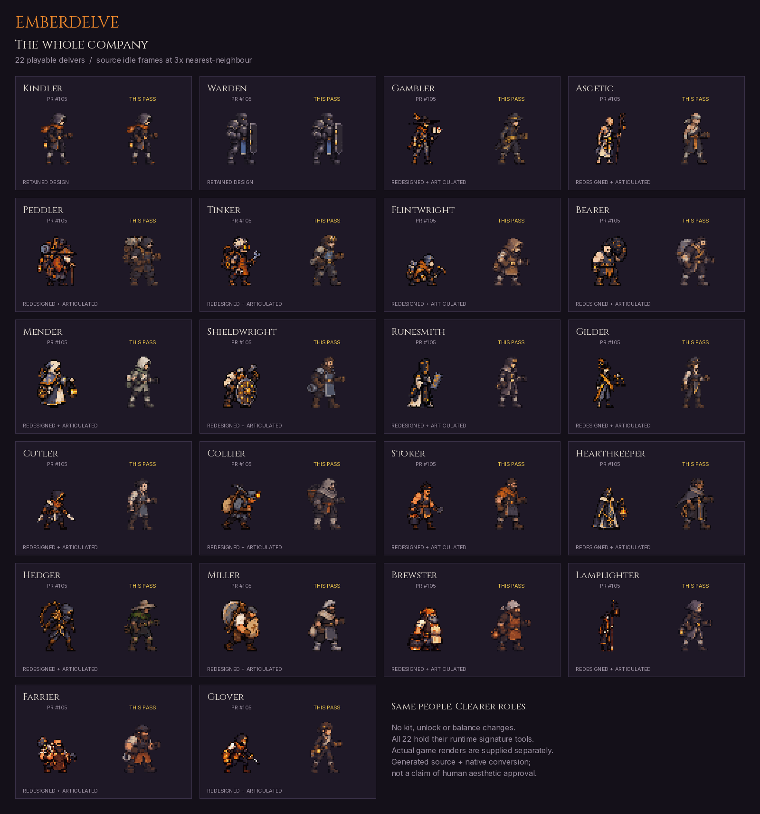
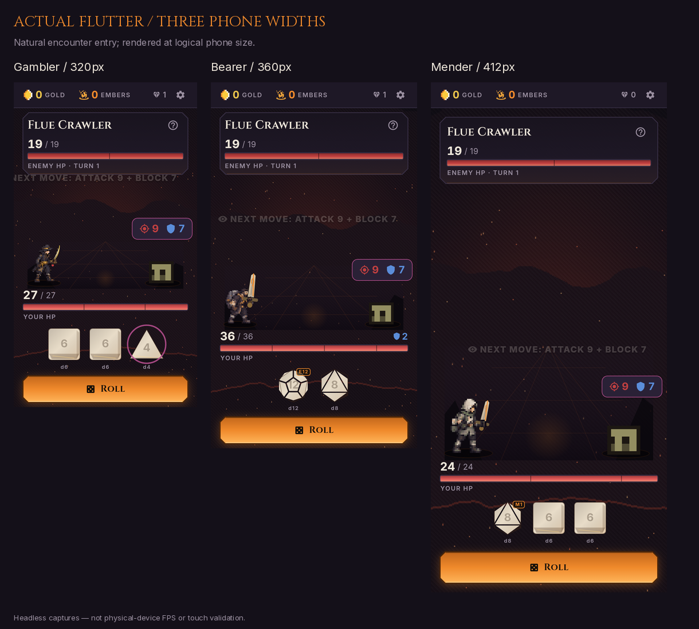

# The whole company — playable-roster visual review

Follow-up to [PR #105](https://github.com/tapiwamakandigona/emberdelve/pull/105).
**VERIFIED scope:** all 22 existing playable delvers, not enemies, bosses or
new characters. The Kindler/Warden designs from #105 are retained; the remaining
twenty are redesigned and all 22 use authored native anatomy in combat.
**ASSUMED creative direction:** practical forge-and-ash tradespeople, with
role-readable silhouettes and tools rather than palette swaps.

## Start with the pixels



This comparison is a labelled **source-frame plate**, not an in-game screenshot.
Every before PNG matches the exact `8a5478447a209e764d963ea8fe05f38202d0d2fc`
baseline manifest; the retained pair is byte-identical.



- [Six-family actual-combat comparison](evidence/six-tool-families.mp4).
- Full-size individual clips: [Hedger / cut](evidence/hedger-cut.mp4),
  [Bearer / crush](evidence/bearer-crush.mp4),
  [Gambler / stab](evidence/gambler-stab.mp4),
  [Runesmith / stamp](evidence/runesmith-stamp.mp4),
  [Peddler / hook](evidence/peddler-hook.mp4),
  [Flintwright / pick](evidence/flintwright-pick.mp4).
- All 22 actual selection portraits: `evidence/picker-360-*.png`.
- Particle-free actual 104px pose plates: `evidence/native-104-group-*.png`.
  Groups preserve roster order; low and high columns are labelled. These
  separate body action from hit particles. All 72/96/104px plates are generated
  by the reproducible capture tool, not painted mockups.
- [Render manifest](evidence/render-manifest.json) and
  [complete raw-capture hash inventory](evidence/capture-inventory.json).

## What changed

**VERIFIED in source and tests:**

- Twenty new generated source models, five groups of four, with full prompts,
  hashes and deterministic native conversion. Portrait/run/hit sheets retain
  the existing format. [Design matrix](design-matrix.md) distinguishes intended
  art direction from what the native output actually contains.
- Explicit hip, neck, shoulder, elbow, wrist, boots and cut regions for each
  remaining delver. Static generated Dart data; no runtime JSON, anatomical
  inference or per-frame image creation.
- All 22 combat figures share a moving wrist between sprite, signature tool
  and foreground glove. Native source-pixel overlaps keep articulated joints
  connected. Unknown IDs and standalone selection portraits retain fallback.
- Six explicit tool-family paths: planted cut, overhead crush, compact thrust,
  stamping jab, catching pull and short pick chop. Low/high commitment differs.
  The delivered Kindler/Warden poses are retained.
- A real defect found by whole-roster rendering is fixed: tempered `custom_N`
  dice now resolve their true catalog size for weapon heat and strike tier.
  Previously the presentation treated them as d6, so the Bearer's d12 or
  Mender's d8 could show a max-tier swing on a non-max roll. Simulation rolls
  and damage were already correct and are untouched.

The actual generated source atlases were inspected: forward empty gloves,
separate boots and broad trade silhouettes are present. Fine prompted details
are not automatically claimed to survive 32×40 conversion. Readability and
artistic suitability remain **proposals for owner review**, not aesthetic
approval inferred from an IoU threshold or an automated description.

## Verified evidence at the render checkpoint

| Check | Evidence |
|---|---|
| Production art | 22 models; **40,798 PNG bytes**, **675,840 decoded sheet bytes**; unchanged alpha/margin/palette/memory assertions |
| Silhouette guard | Maximum IoU **0.8822**, Hearthkeeper/Miller, below unchanged **0.93**; not an aesthetic score |
| Art/anatomy tests | **38/38** new + existing checks; opaque measured wrists, required painted body layers and no lost source pixels |
| Family/grip/condition/contact | **91/91** new + existing tests; **33,000** joint/condition samples |
| Actual raster continuity | **22/22**, **3,960** rendered bodies at 72/96/104px, low/high, healthy/20% HP and transitions; no tolerance changes |
| Cutout cache | **1,239,040 RGBA bytes** for all 22, below **1.25 MiB**; separate from sheet budget |
| Tempered-die regression | Verified red before the lookup fix; **20/20** green after, d4/d6/d8/d10/d12 × four tiers |
| Actual Flutter review | **72/72**, including **66** combat phone combinations, all native pose plates and **66** selection portraits |
| Capture observations | **12,540** samples; max shared-grip error **2.842170943040401e-14 logical px**; every outgoing/incoming hit-flash figure checked |
| Raw render artifacts | **4,608 PNGs**, including **72** native pose plates and **66** picker captures |

The baseline's **1,415 passing tests are not the final-tree gate result**.
Final regression/integrity results will be recorded separately after the
complete gates run. Until then `ROSTER-GATES` remains false.

### Fixture honesty

Phone sizes: **320×568**, **360×640**, **412×892** logical pixels, rendered at
2× PNG resolution using the bundled Cinzel/Inter fonts. Seed **1**, easy,
boon **0**, node **2**, Flue Crawler. Each natural encounter-entry frame is
captured before synthetic state is applied.

To expose both low and high choreography in every unchanged kit, the capture
tool extends enemy HP/max to **999**, forces raw attack faces **1 / sides−1**
with original die/relic floors, recomputes matching combo flags/burn, forces
incoming damage intent **7**, and restores player HP between turns. Original
roll-triggered effects not explicitly replaced are retained. This is **not a
balance demo or naturally earned playthrough**. Tinker's low action uses the
plain d6 with its real relic floor **2**; tempered base IDs/runes are checked.
Fatigue plates deliberately set HP to **20%**. Picker unlocks are test-only.

Each clip is **190 sampled frames / 7.6 seconds / 25fps encoding**. Low/high
action segments are joined; intervening roll/setup time is omitted.
Observations retain both sampled time and actual fixture time. **40ms simulated
sampling is not measured device FPS.** Reduced-motion/text-scaling/blood-off
stills and additive behavioral tests are separate from full-motion clips.

## Reproduce

Use the pinned Flutter **3.44.9 / Dart 3.12.2** toolchain. On an art workstation
with Pillow/numpy and ffmpeg/ffprobe:

```sh
python3 tool/art/build_delvers.py --check
flutter test test/roster_design_test.dart test/roster_articulation_test.dart \
  test/roster_raster_test.dart test/tempered_combat_tier_test.dart
flutter test tool/roster_review_test.dart --reporter expanded
python3 tool/assemble_roster_evidence.py --before-root <exact-PR105-character-PNGs>
```

The last command lays out existing pixels and encodes screenshots; it does
not generate replacement screenshots. Original captures stay under the
capture tool's build output, with every file hashed in the committed inventory.
The repository includes curated evidence, not all multi-gigabyte raw frames.

## Integrity and explicit limits

- Original test exception, declared before implementation:
  `test/combat_articulation_test.dart` now requires exact all-22 opt-in instead
  of the obsolete two-delver limit. Exact retained-pair identity, unknown-ID
  and standalone sprite/tool fallback assertions remain. All other original
  tests are unchanged; additive checks are not substituted for old ones.
- Preserve sealed sim, gameplay/content/IDs/kits/unlocks, saves, purchases,
  dependencies, workflows, version, all non-character assets and prior evidence.
- Inherited supplemental `tool/play_session_test.dart` omitted valid keystone
  routing and historically reported `illegal transition player_turn → keystone`
  / `STUCK`. It was not repaired or rerun here, and is not a verified product
  softlock or a completed UI playthrough.
- Physical-phone touch/FPS, human aesthetic approval and actual Play
  purchase/restore remain **unverified**. Their root gates stay false.
- Source review only: **no merge, release, version bump, signed-build dispatch,
  Play/store action or subagents**.
