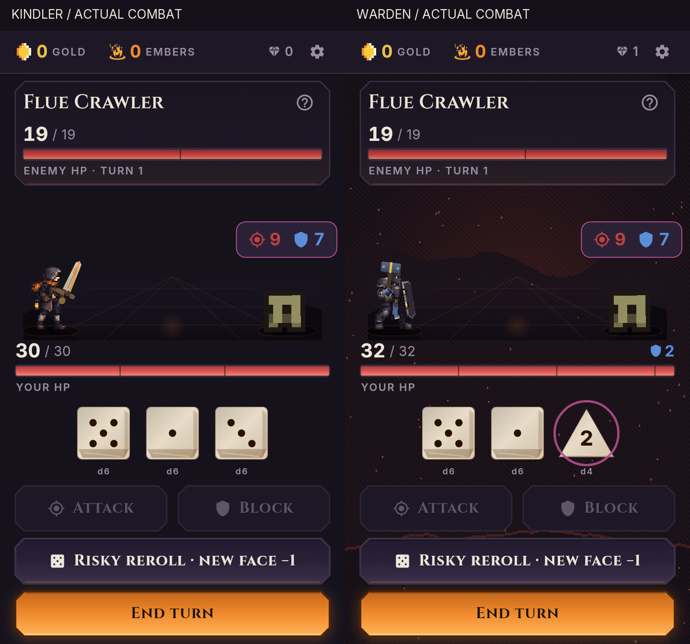

# Emberdelve — contact, body action and character redesign

**VERIFIED source review, not a release.** Builds on open
[#104](https://github.com/tapiwamakandigona/emberdelve/pull/104) at
`0df9d51c4aafb36c8ec38bbd55aeb9a66ce1666e`. Final production source and all
main-suite tests were verified at `ddfc127fab1c934fb5b75f21a33bf7f7b0ad5487`;
later additions are verification-only captures, evidence and documentation.
`main` is the frozen former platformer; this pass belongs to the active
`legacy/dice-builder` game. The new PR stacks on #104's branch so its diff
does not re-review the existing blood toggle.

## Review the result



- [Kindler before/after video](evidence/kindler-before-after.mp4)
- [Warden before/after video](evidence/warden-before-after.mp4)
- [Source sprites and windups](evidence/characters-raise.png)
- [Particle-free 72px combat-size windups](evidence/native-320-raise.png)
- [Particle-free 104px combat-size windups](evidence/native-412-raise.png)
- [Blood-off fatigue at 72px](evidence/native-320-fatigue.png)
- [All 22 model silhouettes](evidence/delver-roster.png)
- [Checksums and capture manifest](evidence/render-manifest.json)

The videos compare unchanged #104 on the left with this pass on the right.
Both use actual Flutter renders, bundled fonts, seed 1/easy, Flue Crawler,
die 1 then die 5, block and enemy turn. Each side contains 175 samples taken
at 40ms simulated intervals. **25 fps describes the evidence encoding,
not measured device performance.** Normal life clocks and ambient effects
need not have identical phase between two independent test runs.

## What changed

### 1. Contact now causes the displayed damage

**VERIFIED:** the simulation still resolves synchronously and is unchanged.
A presentation-only ledger copies HP/guard/intent before an action, then
advances those fields from the simulation's absolute event values:

- Player hits: displayed enemy HP/wounds at **340ms**, not during raise.
- Incoming hits: player HP and spent guard at **440ms**.
- Riposte, thorns, healing and burn follow their respective existing beats.
- Unused guard expires at the end of resolution, not before impact.
- A lethal enemy remains visibly at **0 HP** during the held terminal route.
- Fast-forward, queued actions, reduced motion and existing terminal holds
  retain their regression coverage.

The HUD and body condition listen to contact changes, not every animation
frame. Dice and interaction data stay live.

### 2. Real body layers share the weapon's wrist

**VERIFIED:** Kindler and Warden now use eleven native source-pixel layers,
independent chest/head/arm/leg transforms and a bounded two-bone arm solve.
Low and high dice have distinct weight shift, windup and stance. Their
existing cut and maul weapons use the **same sampled moving wrist** as the
body; the gauntlet is drawn over the shaft. This replaces independent
sprite/weapon idle clocks for these two characters.

Planted boot anchors, a grip-pivoted Warden shield and small overlapping
source-pixel joint caps keep the body assembled at fractional phone scales.
The raster test actually reproduced an ankle gap that coincident joint
math did not detect. Source-pixel overlaps fixed it without painting
flat-color filler limbs or weakening the test.

Decorative life motion stops under reduced motion. Information-bearing
attacks and HP-dependent fatigue remain. Other twenty delvers keep their
existing rendering fallback.

### 3. Two actual character redesigns

**ASSUMED design direction, implemented for review:** Kindler is a lean
soot-worn firekeeper with a hood, restrained orange scarf, workcoat, wrapped
shins and rear belt lantern. Warden is a broader armored threshold guard
with a muted blue cloth panel and furnace-door-like tower shield. This is
intended to distinguish practical forge-world roles rather than recolour
two interchangeable knights.

**VERIFIED:** the new sheets are used in portraits and combat, not just a
concept plate. Neither contains a baked-in primary weapon conflicting with
the runtime blade/maul. The generator emits matching authored hand anchors.
The old generator's `AssertionError: metadata differs` was reproduced and
fixed at the production input, not by deleting metadata or assertions.

The source was AI-generated and refined once, then converted deterministically
to the existing native format. Prompts/source are retained; see
[PROVENANCE](../../PROVENANCE.md). No human-artist or exclusive-copyright
claim is made. The generated source did not reproduce every requested pose
detail; actual native wrist pixels, not prompt coordinates, drive the rig.

**VERIFIED preserved contracts:** all 22 IDs/kits/unlocks, other twenty
character PNGs, enemies, fonts, sounds, saves, purchase code, dependencies,
workflows and simulation. Only Kindler/Warden sheets and their entries in
sprite metadata differ among shipped assets. Native cells remain 32×40 in
64×120 sheets, two idle/two walking/one hit frame, 6 fps, binary alpha and
two-pixel margins.

## Verification

| Gate | VERIFIED result | Evidence |
|---|---|---|
| Baseline #104 | Analyzer clean; 1,387 tests | [baseline tests](evidence/baseline-tests.txt) |
| Final analyzer | No issues, including supplemental probes | [analyzer](evidence/evidence-analyze.txt) |
| Main test suite | **1,415/1,415**, exit 0 | [full output](evidence/final-tests.txt) |
| Contact regression | 12 cases red on #104, green after fix | [red](evidence/contact-red-control.txt), [green](evidence/contact-green.txt) |
| Body/grip | 12 tests; 3,000 pose/condition samples, live consumer wiring, reduced-idle paint/pixel checks | `test/combat_articulation_test.dart` |
| Raster continuity | 120 posed bodies at heights 72/96/104; head, arm, boots and shield share a painted component | [red](evidence/raster-red-control.txt), [green](evidence/raster-green.txt) |
| Actual phone render | **7/7**: two characters × three phone sizes, plus source/pose plate | [render log](evidence/phone-render-tests.txt) |
| Particle-free proof | **2/2**, actual 72/104px figures; 12 pose/fatigue plates | [native log](evidence/native-pose-tests.txt) |
| Production art build | **22 models**, 38,952 PNG bytes / 675,840 decoded RGBA bytes; max silhouette IoU **0.7321** | [build result](evidence/final-art-build.json) |
| SFX | All reachable cascades clear ceiling; existing full attack **−0.90 dBTP TIGHT** | [SFX](evidence/final-sfx.txt) |
| Contract/credential audit | Original-file hash and complete-inventory scans | [integrity](evidence/integrity.json) |

The 28 new main-suite cases are 12 contact, 12 articulation, two design and
two raster tests. All **262 original test files are byte-identical**.
Generator validation assertions are preserved. Two cached eleven-layer
rigs add **112,640 decoded RGBA bytes**, with no additional runtime asset
format or dependency.

Phone captures cover **320×568, 360×640 and 412×892** logical pixels,
**1,050** sampled state/grip observations, full and partial guard, forced
20%-HP blood-on/off, reduced motion and 1.3× requested system text.
Maximum sampled grip mismatch is **2.01×10⁻¹⁴ logical pixels**.
The existing HUD text-scale clamp remains; this is not a claim that every
label renders at a literal 1.3× on the shortest phone.

Layout assertions cover stat bars, dice, enabled Attack/Block button bounds
and framework exceptions—not every painted pixel. Forced guard/HP fixtures
are labelled and are not presented as naturally earned run states.

## Reproduce

Use the repository-pinned Flutter **3.44.9 / Dart 3.12.2**, Python with
Pillow/numpy, and ffmpeg for the SFX gate. Set `FLUTTER_ROOT` for the full
phone probe's MaterialIcons font.

```sh
flutter analyze
flutter test
python3 tool/art/build_delvers.py --check
python3 tool/sfx_headroom.py
flutter test tool/visual_sep17_review_test.dart
flutter test tool/rig_pose_phone_test.dart
```

The rendering tools write to ignored build output. Main checks do not
accept regenerated goldens; raster continuity is computed from rendered
alpha components, not from matching an expected screenshot.

## Not verified / not changed

- **Human aesthetic approval and physical-phone touch/FPS are not verified.**
  Automated video descriptions were inconsistent and were not accepted as
  art approval. The supplied final pixels are the review material.
- This is **two redesigned/rigged delvers**, not a 22-character redesign,
  enemy animation overhaul, balance change or depth expansion.
- Existing `tool/play_session_test.dart` is still keystone-unaware. #104
  recorded `illegal transition player_turn → keystone` followed by `STUCK`.
  It was not rerun or repaired here; that is not verified evidence of a
  product softlock. Its root follow-up remains false.
- Physical full-run `M1-3` and real Play purchase/restore `M4-2` remain false.
- No version bump, merge, release, signing dispatch or store action.
  #102 and #104 remain open. Remote CI must be read on the new PR; local
  success is not a substitute for it.

See [append-only progress](progress.md) for failures, retries and the
six-iteration guard. This pass used five implementation/verification
iterations; the sixth corrective reserve was not used.
